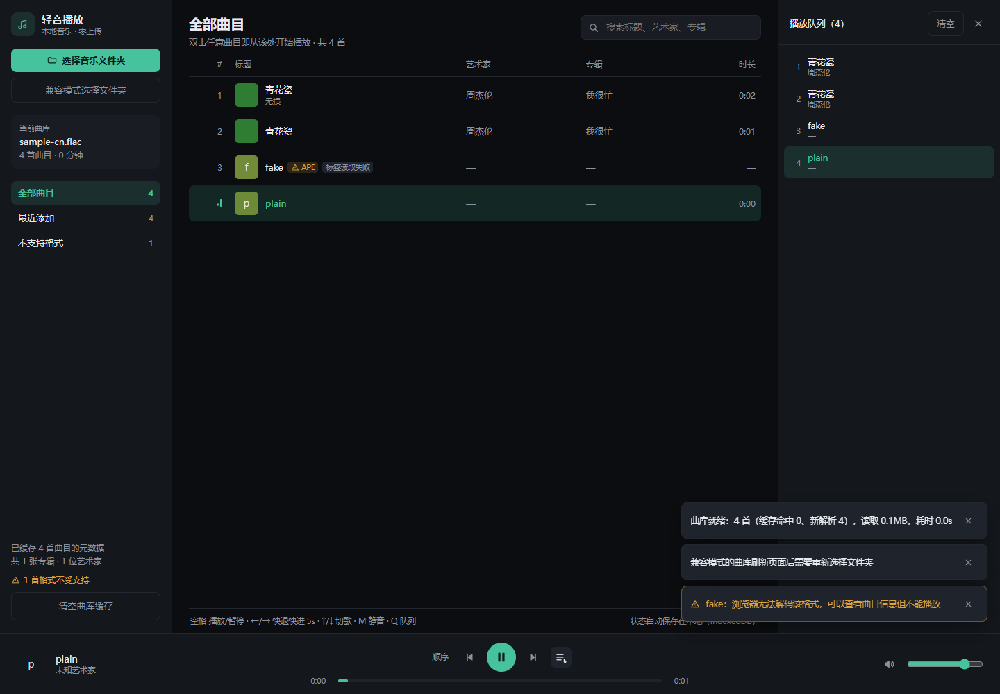

# 轻音播放

跑在浏览器里的本地音乐播放器。指向自己的音乐文件夹即可播放：**零安装、零上传、不依赖任何在线服务**。



产品设计与技术方案见 [docs/](docs/)：

| 文档 | 回答的问题 |
| --- | --- |
| [产品技术文档](docs/产品技术文档.md) | **做什么**：定位、边界、功能清单、里程碑、风险 |
| [技术方案](docs/技术方案.md) | **怎么做**：模块划分、接口、数据结构、算法、性能预算、测试策略 |
| [M0 技术验证结果](docs/M0-技术验证.md) | **凭什么这么做**：实测数据与结论 |

## 快速开始

```bash
pnpm install
pnpm dev            # 打开 http://localhost:5173，点「选择音乐文件夹」
pnpm build          # 产出 dist/（含 PWA 外壳，可安装到桌面）
pnpm verify         # typecheck + 单测 + 产物检查（交付前必跑）
pnpm check:ui       # 本机 Edge 界面冒烟（需要本机装了 Edge）
```

首次使用点「选择音乐文件夹」（Chrome / Edge 走 File System Access API）。
之后每次打开只需点一次「恢复曲库」——浏览器要求一次用户手势重新授权，做不到全自动加载。

## 已实现的范围（M1–M3）

**曲库接入**

- 两条入口统一为 `MusicSource`：`showDirectoryPicker()` 主路 + `<input webkitdirectory>` 回退路
- 三级读取解析元数据：L1 探测 16KB → L2 按容器算准的元数据区 → L3 兜底读整文件
  （实测真实文件只读文件头就够，且排在探测窗口之后的大封面不会被漏掉）
- GBK 老标签保守回退：宁可保留乱码，也不把正常文本改坏
- IndexedDB 增量缓存：二次打开全缓存命中，完全不碰音频文件；删除与孤儿缓存自动清理
- 虚拟化曲目列表 + 中文排序检索；扫描进度可见、可取消

**浏览与检索**

- 六个视图：全部曲目 / 艺术家 / 专辑（分组头可收起）/ 最近添加 / 最近播放 / 问题文件
- 检索同时支持汉字、拉丁字母与**拼音首字母**（搜 `zjl` 找到周杰伦，搜 `qhc` 找到青花瓷）；
  带变音符号的标签也能用普通字母搜到（`boa` → `bôa`）
- 中文排序用 `Intl.Collator`，表头点击切换升降序
- 「问题文件」视图列出浏览器放不出声或读不出标签的文件，并说明下一步该做什么

**歌词**

- 扫描时自动认领同目录的 `.lrc`（同名 / 去音轨号 / `艺术家 - 标题` / `lyrics` 子目录；
  有歧义不猜，交给手动）
- 三种手动入口：导入 `.lrc` 文件、拖到歌词面板、粘贴歌词文本；GBK 老歌词也能正确解码
- 面板按行高亮并自动滚动，**点击任意一句跳到那一句**；时间轴偏移可 ±0.5s 微调
- 从网上下来的歌词里那些"不是歌词的内容"会正确处理：署名行（作词/作曲）弱化显示，
  纯音乐占位（`纯音乐，请欣赏`）识别为"这首是纯音乐"，而不是当成一句歌词去高亮
- 播放条上方有一行迷你歌词，点击打开面板
- 「去搜歌词」按你自己配置的地址模板打开新标签页（`{title} {artist} {album} {trackNo} {keyword}`），
  也可以只复制关键词；**应用不请求、不解析任何第三方内容**

#### 给整个曲库补歌词：用外部工具，播放器负责认领

播放器自己不去抓歌词，但它会自动认领音乐文件夹里的 `.lrc`——所以「批量补歌词」交给成熟工具做最省事。
[LyricFlow](https://github.com/laoning666/lyricFlow)（批处理工具，CC BY-NC 4.0）做的正是
「扫文件夹 → 搜索 → **存成与音频同名的 `.lrc`**」，与我们的同名规则天然对接。下面是**实测过**的做法：

1. 取源码（本机 `github.com` 被 DNS 解析到 `127.0.0.1`，直连不通，所以走 CDN 镜像）：
   `https://cdn.jsdelivr.net/gh/laoning666/lyricFlow@main/<路径>`
2. 装依赖（只要两个）：`pip install httpx mutagen`
3. 跑：
   ```powershell
   $env:MUSIC_PATH        = 'D:\轻音播放\新建文件夹'
   $env:API_PROVIDER      = 'lrcapi'                 # 默认的 tunehub 主机在本机解析不了
   $env:LRCAPI_URL        = 'https://api.lrc.cx'      # 已验证可用
   $env:DOWNLOAD_COVER    = 'false'                   # 平铺文件夹只有一个目录，别塞 cover.jpg
   $env:UPDATE_LYRICS     = 'false'                   # 保持关闭：不改写音频文件
   $env:UPDATE_COVER      = 'false'
   $env:UPDATE_BASIC_INFO = 'false'
   python -m src.main
   ```
4. 回到播放器 → 歌词面板底部点**「重新扫描歌词」**→ 全部认领进来

实测结果：2 首 / 2 首命中、同名文件生成正确、我们侧 `claimed 2`、无未匹配无歧义；
《牵丝戏》与《STYX HELIX》第 30 秒的当前句都对得上。

两个已知小瑕疵：① 生成的歌词首行常是 `[00:00.000] 作词 : X` / `作曲 : X` 这类署名行，
会被当作一句歌词显示；② 它按「标签里的歌手 + 标题（+ 专辑）」去搜，选错版本时歌词内容会不对——
用面板的**预览 + 偏移微调**就能看出来。

`UPDATE_*` 三个开关**务必保持 false**：它们会把歌词/封面写进音频元数据，不可逆；而我们只读 `.lrc`，
根本不需要。另外 `OVERWRITE_LYRICS` 默认就是 false，不会覆盖你已有的歌词。

**播放**

- `<audio>` + 对象 URL（不把文件读进内存，切歌时 revoke）
- 四种模式：顺序 / 列表循环 / 单曲循环 / 随机（洗牌，不连续重复）
- 单曲循环只在**自然播放结束**时重复本首，手动「下一首」仍前进
- 播放队列抽屉；行内「下一首播放」；不可播放格式（APE / DSD / WavPack / ALAC）自动跳过并说明
- 拖动进度条显示预览时间，抬起指针才跳转
- MediaSession：系统媒体键与锁屏 / 控制中心
- 快捷键：空格 播放暂停 · ←/→ 快退快进 5s · ↑/↓ 切歌 · J/K/L 后退/暂停/前进 · +/− 音量 · M 静音 · Q 队列 · Y 歌词 · Ctrl+F 搜索

**体验收尾**

- 状态持久化：音量、播放模式、当前曲目与进度、最近播放历史（节流 + 暂停 / 切歌 / 页面隐藏时补写）
- 目录句柄持久化 + 一键恢复曲库
- PWA：Service Worker 缓存应用外壳，可安装到桌面

## 代码结构

```
src/core/        纯逻辑：格式判定、缓存键、元数据区、GBK 回退、拼音首字母、队列与模式、排序检索
src/platform/    平台适配：字节读取、曲库来源、元数据解析、IndexedDB、播放引擎、MediaSession
src/ui/          React 组件 + Zustand store
m0/              M0 手动验证页（pnpm dev:m0）
demo/            交互原型（早期用于定交互，已由 src/ui 取代）
tests/fixtures/  真实音频样本（ffmpeg 生成，已提交，pnpm test 不依赖本机 ffmpeg）
```

依赖方向是硬约束：`ui → platform → core`，**`core` 里不允许出现任何平台 API**。
这条由 `src/core/no-platform-api.test.ts` 用测试强制，而不是靠自觉——它让音频与 DOM 之外的逻辑
可以 100% 单测，也让将来换 UI 框架或上 Electron 不用重写业务逻辑。

## 测试与验证

```bash
pnpm typecheck      # tsc --noEmit
pnpm test           # 422 项单测（core 246 / platform 110 / ui 66）
pnpm test:demo      # 37 项交互原型的 node:test 检查
pnpm check:static   # 界面层静态一致性（类名与样式、冒烟选择器）
pnpm check:bundle   # 构建 + 扫产物里的 node: 引用 + PWA 外壳检查
pnpm check:ui       # 真实 Edge 里的界面冒烟（内置自检 + 完整播放链路 + 刷新后缓存/状态恢复 + 截图）
pnpm bench          # 真实浏览器 + 3000 首真实文件的性能基准（pnpm bench 500 可小规模快跑）
```

`pnpm bench` 会现生成一份 3000 首的测试曲库（`.bench-library/`，跑完自动删除），
逐个量出首次扫描、全命中重扫、刷新到列表可见、滚动帧率与实际读取字节数。3000 首实测：
首次扫描 9.4s、刷新到可见 241ms、读取 46.4MB、滚动 60fps。详见 [技术方案 6.2](docs/技术方案.md)。

界面冒烟用 `playwright-core` 驱动**本机已有的 Edge**（不下载 Chromium），它验证的是自动化能覆盖的部分：
页面跑得起来、无控制台报错、内置自检（`?selftest=1`）逐项通过、内置样本能入库并真的出声、
留一张 `artifacts/ui/app.png` 截图。

无法自动化的部分保留手动清单：`showDirectoryPicker()` 的原生弹窗、真实曲库的乱码率、
锁屏媒体键、PWA 安装。详见 [技术方案 9 节](docs/技术方案.md)。

## 平台与限制

- 主支持 Chromium 系（Chrome / Edge）；其它浏览器降级到 `<input webkitdirectory>`，刷新后需重新选择
- APE / WavPack / DSD 等浏览器解不了的格式**明确标记为不支持**，而不是静默失败
- 曲库规模假设数千首：列表已虚拟化，封面走 LRU（约 120 张），扫描单线程异步分片
