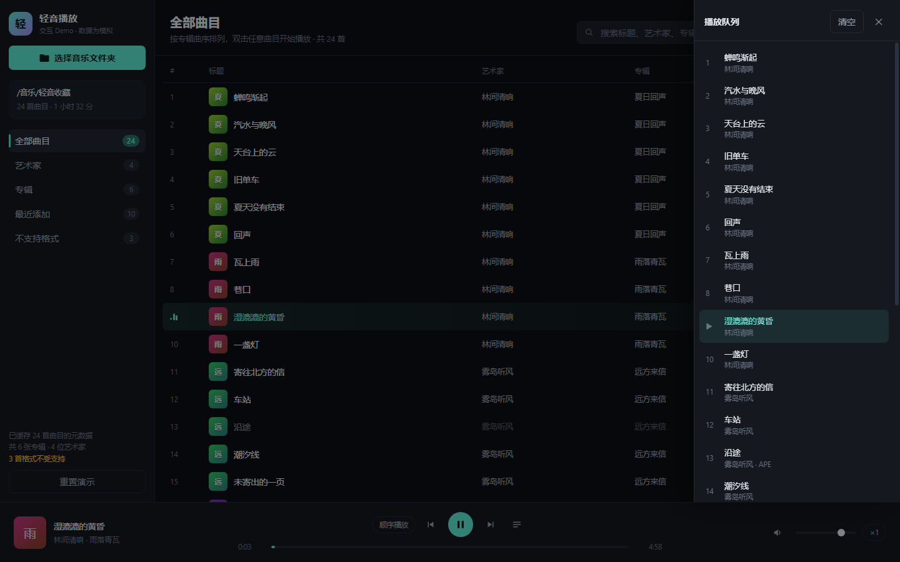

# 轻音播放 · 交互 Demo

在写正式实现之前，先把页面结构与操作流程跑一遍，确认交互是否合理。

> **本目录是交互原型，不是产品。** 正式实现已经在 `src/`（React + Zustand + IndexedDB + 真实播放），
> 运行方式见仓库根目录的 [README](../README.md)。这里保留下来是为了记录交互是怎么定下来的：
> 本 Demo 里的队列推进、四种模式、检索排序等行为已按同一套语义迁进 `src/core`，
> 并由 `src/core/queue.test.ts` / `src/core/sort.test.ts` 锁定。

> **数据全部为模拟。** 不会读取你的任何文件，也不会真正播放音频——进度条按"演示速度"推进，
> 目的是让你能快速观察到自动切歌、播放模式与队列的行为。



## 打开方式

双击 `index.html` 即可。无需构建、无需本地服务器、无第三方依赖。

（因此代码使用普通 `<script>` 标签而非 ES module——`file://` 协议下 ES module 会被跨源策略拦截。）

## 可以体验的流程

**曲库接入**

1. 空状态引导 → 点击「选择音乐文件夹」，完成目录选择与元数据扫描的完整过程
2. 扫描结束后曲库填充，侧栏统计与顶栏副标题同步更新

**播放控制**

3. 双击任意曲目开始播放；单击为选中
4. 空格播放 / 暂停，方向键快退 / 快进 5 秒
5. 拖动进度条跳转；拖动音量滑块或点击喇叭图标静音
6. 点击「×1」按钮可切换 ×1 / ×4 / ×16 演示速度，用于快速观察自动切歌

**播放模式**

7. 点击模式按钮循环切换：顺序播放 → 列表循环 → 单曲循环 → 随机播放
8. 留意差异：单曲循环在**自然播放结束**时重复本首，而手动点「下一首」仍会前进
9. 切到随机播放时会重新洗牌，避免连续重复同一首；顺序播放走到末尾会停止并提示

**队列**

10. 点击播放条右侧的队列按钮打开抽屉：可跳转到任意曲目、移除单项、清空队列
11. 队列中当前曲目高亮显示，移除当前项后播放会停止等待

**不支持格式**

12. 双击 APE 格式的曲目（如「沿途」「水压」），会提示浏览器无法解码，并自动跳到下一首可播放的曲目

**检索与视图**

13. 搜索框实时筛选标题 / 艺术家 / 专辑；在艺术家与专辑视图下同样生效
14. 点击表头（标题 / 艺术家 / 专辑 / 时长）切换排序，再次点击切换升降序
15. 点击艺术家或专辑卡片，会回到列表并筛选该分组
16. 侧栏可切换到「最近添加」与「不支持格式」视图

**状态持久化**

17. 导入曲库后刷新页面（F5）：曲库、音量、播放模式与上次播放到的曲目和进度都会恢复
18. 「重置演示」按钮会清除本地缓存并回到初始空状态

## 文件说明

| 文件 | 职责 |
| --- | --- |
| `core.js` | 纯逻辑：时间格式化、检索排序、洗牌、队列上下首、曲库统计、模拟数据。不引用任何浏览器 API |
| `app.js` | 交互与渲染：状态编排、事件绑定、模拟播放推进。逻辑一律委托给 `core.js` |
| `index.html` | 页面结构 |
| `style.css` | 样式（深色主题，桌面优先） |
| `core.test.cjs` | `core.js` 的单元测试 |
| `ui-check.cjs` | 界面层静态一致性检查（见下） |

## 测试

```bash
node --test demo/core.test.cjs demo/ui-check.cjs
```

`core.test.cjs` 覆盖 31 项纯逻辑断言（含中文排序、洗牌无重复、四种模式下的上下首计算、
搜索过滤、曲库统计边界）。

`ui-check.cjs` 覆盖 6 项界面层一致性检查。界面无法做真实渲染测试，但界面层最常见的错误是
"引用了不存在的东西"——id 拼错、类名与样式不一致、调用了未导出的 API。这类问题在浏览器里
往往只是静默失效，因此用静态检查兜住。

## 与产品文档的对应关系

本 Demo 对应 [产品技术文档](../docs/产品技术文档.md) 第 3 节「主要功能（MVP）」中的界面与流程部分。
音频解码、元数据解析、IndexedDB 缓存、目录句柄持久化与 PWA 均未实现——这些属于 M0/M1 的
技术验证范围，需要在正式实现时用真实 API 替换。
